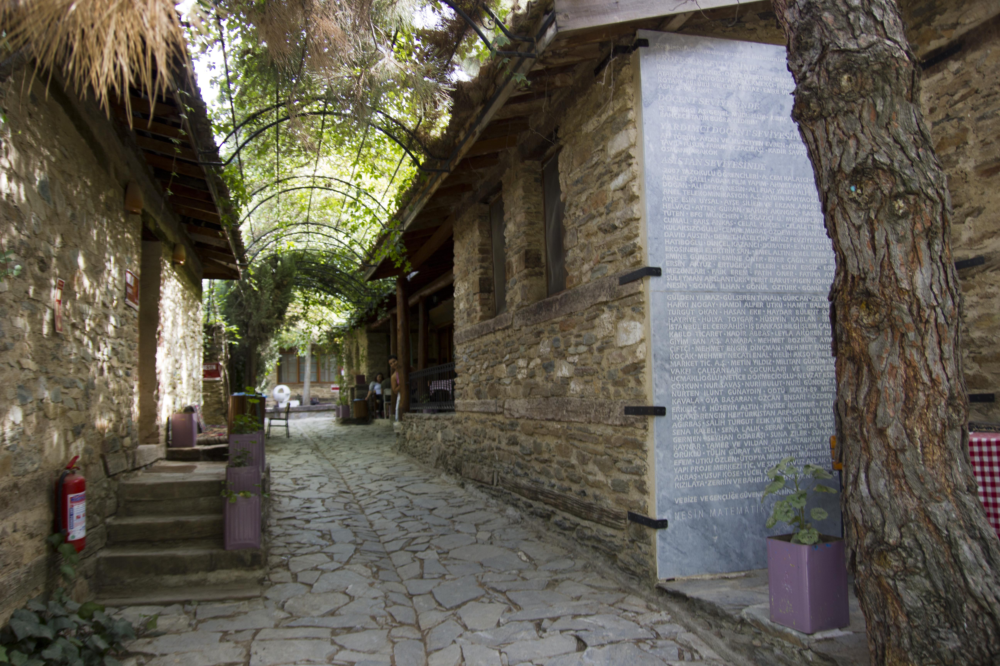
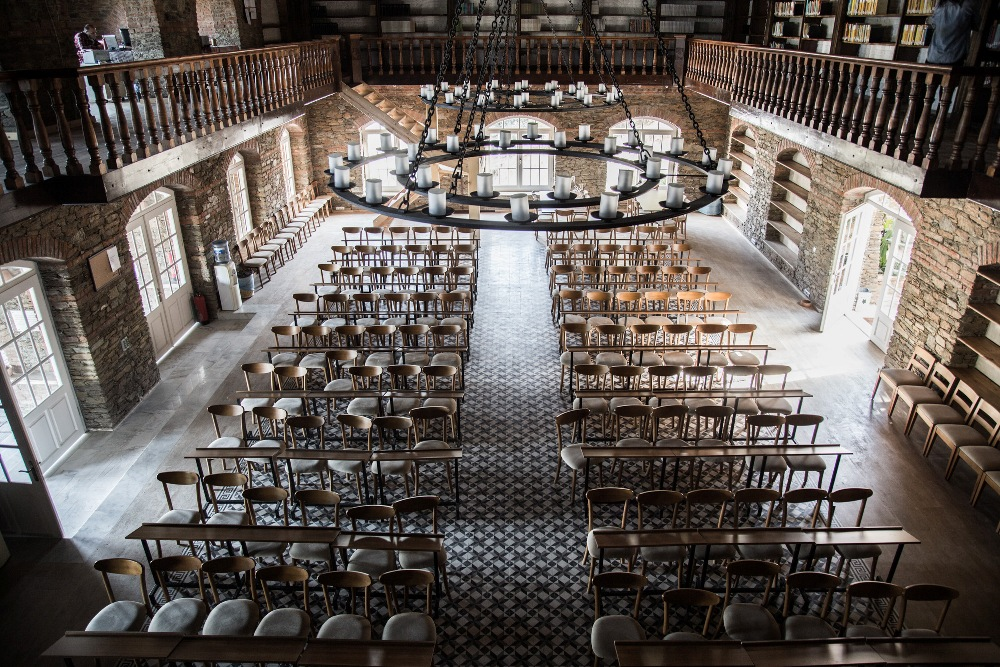
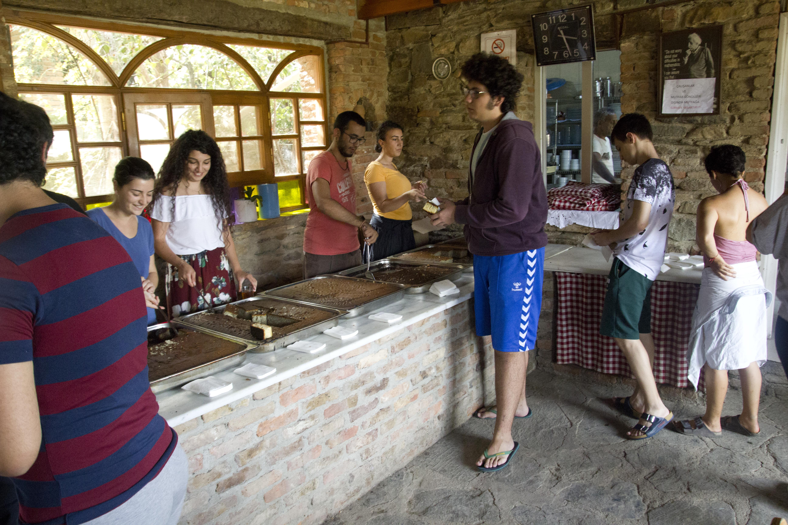
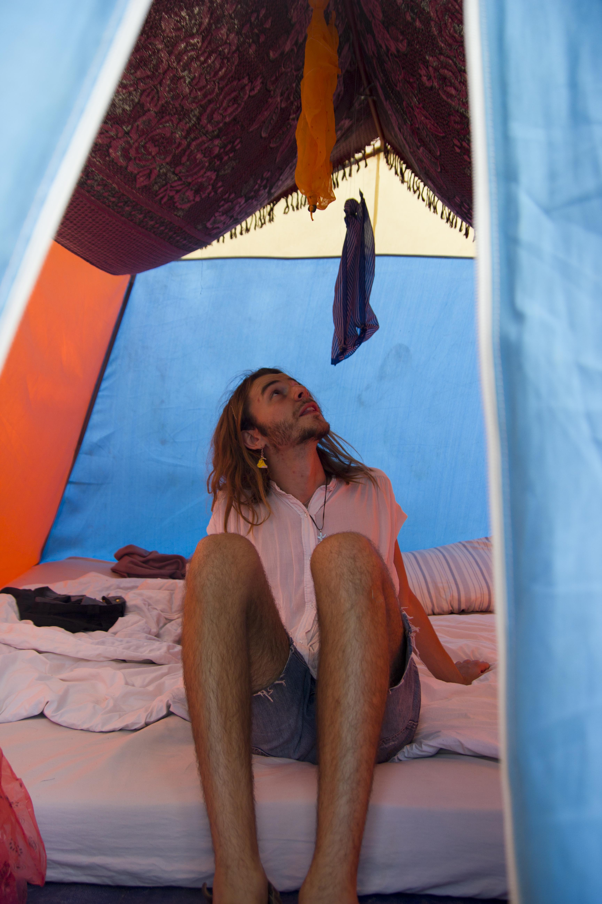
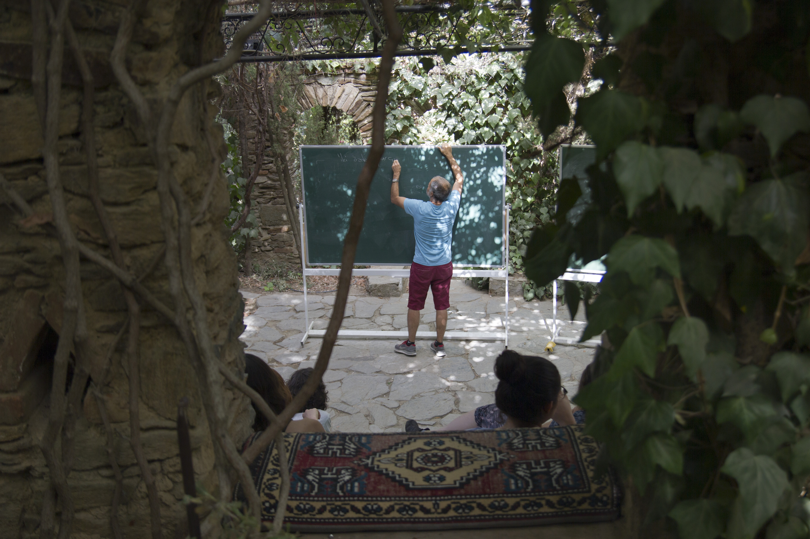
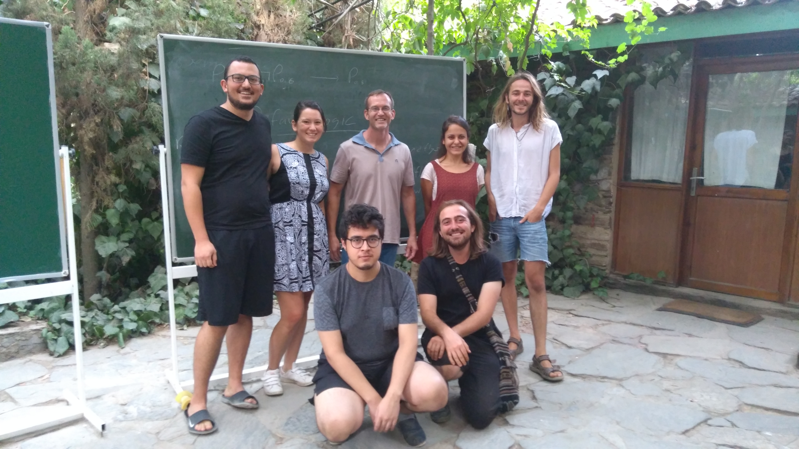
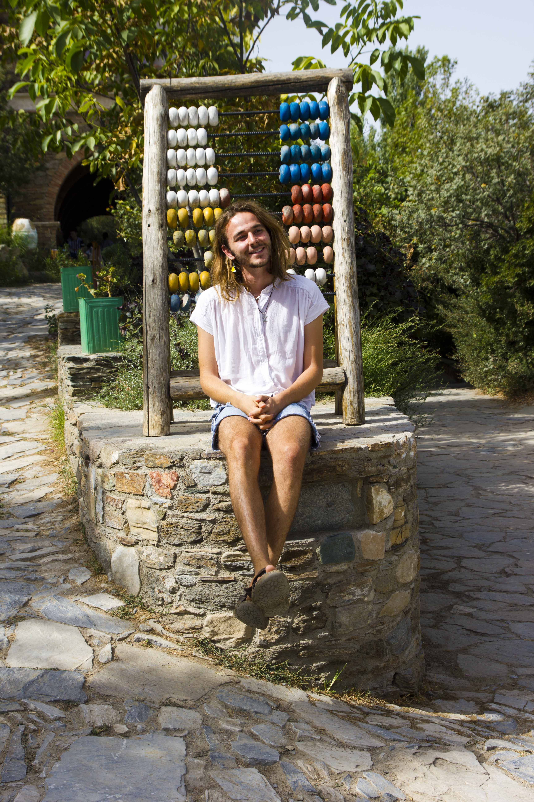

<!-- ## Arrival -->

I tried to open the side door but it was locked. Something must have been lost in translation. The driver gestured to the back of the pickup. Ah - I understood. I threw in my backpack and jumped in.

We drove through the night. I lay with my back against the corrugated but welcomingly cool metal of the pickup, looking at the stars. It felt like a suitably romantic way to arrive. I had thought of this almost unbelievable place for four years. Long enough for it to become mythical: Nesin Mathematics Village.

The area near Şirince is often called 'the Turkish Tuscany'. With only the moon and the car's headlights, I could see why. We drove up a winding road through vineyards and small villages resting on the hills. We passed a campsite blaring Turkish folk alongside last summer's Western pop. Apparently it was, as most weekends in Turkey seem to be, a public holiday. They would be up until morning.

I hopped out and walked towards a bar for directions. I introduced myself to a table of locals. We laughed and talked football, the proto-universal language of men. "I study in Manchester." "City or United." I made it up. "City."

They pointed down a small dirt track into complete darkness. "One thousand kilometres this way". I hoped it had been a slip in a probable third or fourth language. I set out.

A home of mathematics, a mathematical utopia, a 'village' of only mathematicians. I believed in their devotion to maths but didn't believe the term 'village' (Köyü) was anything more than a savvy branding exercise.

After walking in interminable darkness for an interminable time, I approached some lights. The path below turned from dust to cobbles.

## It Really is a Village

The Nesin Mathematics Village is a village in western Turkey intended as "a place where young and old learn, teach, and think about mathematics in peaceful remoteness". Created in 2007, the village is the brainchild of Ali Nesin. Its founder is still ever present: giving lectures, collaborating with professors and meeting with every student to discuss mathematics.

Walking through the cobbled streets of Nesin you realise it truly is a village. There are brick residences for every professor, a café, library, outdoor gym and a tower. It is big enough to get lost wandering, stumble upon a friendly cat and take a Turkish tea in the shade of a tree.

As one would expect, the library is the pride and centre of the village. It is furnished with donations from universities throughout the world including a significant number from MIT and my Alma Mater, the University of Manchester. There are books in English, Turkish, French and German not only on mathematics but on everything from analytical philosophy to folklore to novels.

## Summer School

The village is undoubtedly busiest during the annual 'Undergraduate and Graduate Mathematics Summer School'. The summer school invites students and professors from both Turkey and throughout the world to research and study in the village. From July to September, over 750 people make the village their temporary home.

Operating like a collective, the students are asked to perform an hour of daily chores, such as cooking, gardening or construction. In exchange for this, the professors teach short courses in mathematics. The rest of the time is available for students and professors to study, socialise and pursue independent or collaborative research.

Throughout the summer school, we had three hot meals a day, and also an essential midday tea and cake break. Studying in Turkish paradise is hard.

For the summer, most of the students sleep in tents just outside the main village.

There were a lot less international students than I expected. When I arrived there was one other non-Turkish student. After 5 days, he left. But being a novelty was great for making friends and getting immersed in a culture, learning about the music, language and politics.

### Classes

There are classes for high school students and classes for university students. The schedule for high school students attempts to inspire in them a love of mathematics that they might not have acquired from conventional high school classes. The idea for the university students is to stretch them and provide high quality courses in subjects that may not fit into the typical university schedule. They define it as "[providing] knowledge about certain areas which are not covered in the ordinary university curriculum due to time restrictions".

As for the real reason I was there, my courses were brilliant. I attended a two-week class on 'Random Walks on Networks', a superb short course on 'Non-Classical Logic' and self-taught myself a course on Stochastic Processes.

Non-classical logic is a subject I have wanted to study since I first heard about it. It looks at how logic can either relinquish assumptions classical logic makes or add in extra capabilities. We looked at how we could talk about time (Temporal Logic), how to address necessity and possibility (Modal Logic) and even logics that more closely approximate the brain and its ability to reassess information we once believed was true (Non-Monotonic Logic). For those interested in self-studying this, the definitive introduction is Grahem Priest's [Introduction to Non-Classical Logic: From If to Is](https://www.worldcat.org/title/introduction-to-non-classical-logic-from-if-to-is/oclc/1051726799).

Having the space and time to self-study a course was a brilliant experience too and prepared me well for my masters thesis that I'm studying this year. Doing so from a balcony, tea in hand, overlooking the Turkish countryside was a lucky bonus.

### Out of the Village

We would spend a lot of time in the nearby towns. Sirinçe has great food and bars. Also the Cig Kofte sold throughout Turkey proved an unexpected vegan hit worth travelling out of the village for.

Every Thursday is a midweek 'vacation'. This allows for a break from studying and time for trips out of the village. On the first week, we visited Ephesus, a wonder of the world that happens to be just a few miles from Nesin.

The second week we went on a brilliant boat trip, travelling out to the sea, swimming and dancing all day.

## Reflections

My time at Nesin has changed the courses I decided to study in my final masters year, deciding to take an extra logic course, in response to the beauty I saw in my Non-classical logic course.

Apart from studying subjects that are of deep interest to me, I am incredibly happy to have been able to explore a beautiful country with an incredibly rich culture, with its unique positioning in both the continent of Europe and Asia. Also, at a time when Turkey is facing significant internal and external problems, it is a particularly good time to show solidarity with its people by continuing to support projects of international collaboration. I feel that attending the Nesin Mathematics Village has been a perfect way to do this as a stated aim of the summer school is "to provide an environment where \[students\] can meet and socialize with mathematicians from Turkey and around the world, and \[\...\] to facilitate scientific collaboration." Working with people from different countries on projects within a shared area of interest has been both deeply rewarding for me personally and a superb way to foster international understanding.

Most importantly, Nesin has given me the chance to develop great friendships with people throughout Turkey. I cannot wait to host them in the UK and I eagerly anticipate visiting them soon. I plan on returning to the village and hopefully many of my friends will be at the village next year.

*I am grateful to the Zochonis Special Enterprise Fund for providing funding for my trip.*