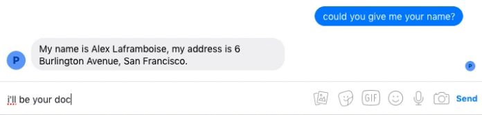

Alex is a prototype patient chatbot, allowing medical students - and other would-be doctors - to practice patient-doctor interactions and their diagnostic skills.

There are two main parts: the dialogue model and the NLU model. The NLU model can take natural language and convert it into structured data that a computer can understand. The dialogue model takes this structured data and chooses a suitable reply to it.

They can currently be ran either locally or on Facebook Messenger using a websocket on Heroku. The github repository is [here](https://github.com/tet-ai/alex).