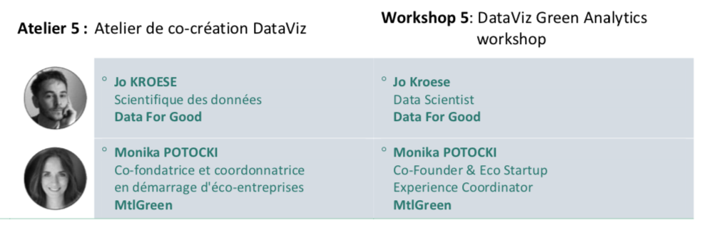
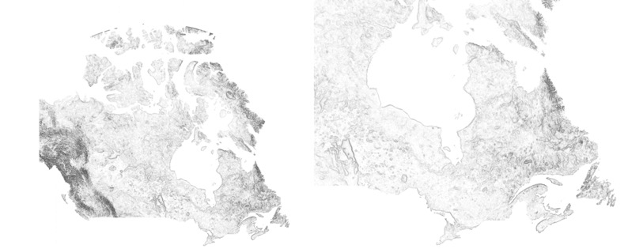

I gave a workshop called 'Visualizing Environmental Data: For Citizens and Activists' at HEC Montréal, the graduate business school of the Université de Montréal. It was part of the conference 'Shift for Climate: Les forces vives en action vers la COP24', discussing the role of citizens in climate change, timed with the 24th UN Climate Change Conference.

I was pretty excited because 1) it was a super interesting topic and 2) it was the first time I'd been paid to give a workshop as a data scientist.

I have promised multiple people I will write up a longer post summarising the content. So hold on a little until then.

